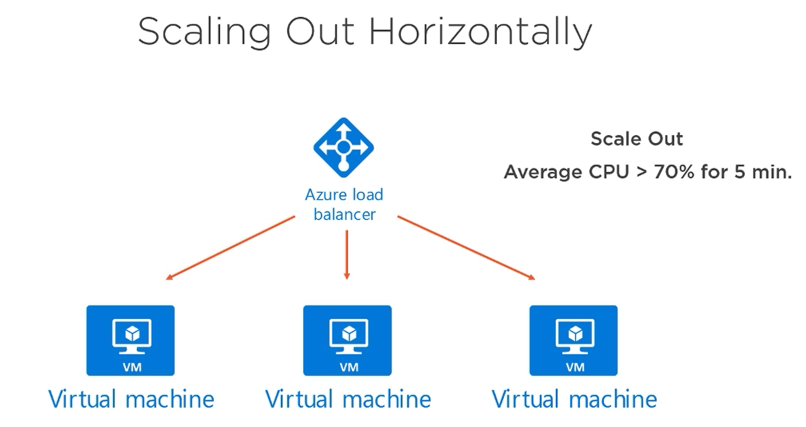
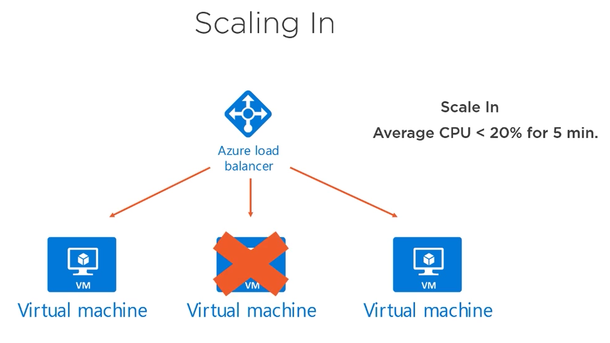

# Create and Manage Virtual Machines on Microsoft Azure

## Content
1. Overview
2. Certification Exam
3. Deploying Azure Virtual Machines
   1. Deploy Virtual Machines
   2. Storage Accounts
4. Configuration Management, Automation, and Debugging
   1. VM Agent and Configuration Management
      1. Getting Started with PowerShell DSC
   2. Azure Resource Manager Templates
5. Configure Azure Virtual Machine Networking
   1. Network Security Groups
6. Scaling Azure Virtual Machines
   1. Scale Sets
7. Monitoring Azure Virtual Machines
8. Working with Azure DevTest Labs
   1. Policies
   2. Custom Images and Formulas
9. Building a Highly Available Application
   1. Available Sets
   2. Load Balancer
   3. Azure Application Gateway
   4. Architecture for an N-tier Application
10. Learning Checks

## Overview
First course in a learning path for the 70-532 certification exam.
* Create Windows and Linux servers
* Configuration management
* Virtual networking in Azure
* Creating virtual machine scale sets
* Monitoring health and performance
* Build a load balanced web application

## Certification Exam
[Learning Path: Developing Azure Solutions (70-532)](https://www.microsoft.com/en-us/learning/exam-70-532.aspx)  
This course counts for 20-25% of the exam as of 07/08/2018 (DD/mm/YYYY)  
[Browse all of the certifications](https://www.microsoft.com/en-us/learning/browse-all-certifications.aspx)  
[Get Hands-on Practice](https://azure.microsoft.com/en-us/free/)  
[Do the learning checks on PluralSight](https://app.pluralsight.com/library/courses/microsoft-azure-create-manage-virtual-machines/learning-check)  
[Take the official practice test](https://www.microsoft.com/en-us/learning/exam-70-532.aspx#practice-test)

## Deploying Azure Virtual Machines
  
[Azure Virtual Machine Architecture](https://docs.microsoft.com/en-us/azure/architecture/reference-architectures/n-tier/windows-vm)  
[Azure portal](https://portal.azure.com)

### Deploy Virtual Machines
Virtual machine images are placed under compute in the marketplace.  
You can save up to 40% of the compute cost if you already own a Windows Server license and its covered by an active software assurance agreement.

Best practise is to use a managed disk for a new virtual machine.
When creating a new managed disk for a virtual machine, you can based it of a snapshot, a storage blob, or create an empty disk. The maximum size of a SSD is 1TB (could be 4TB?).  

Shutting down the VM allows for changing the harddrive of the OS. -> If you want to deallocate the virtual machine, and not pay for it when its closed, you'll have to go through Azure and press the stop button on the overview of the VM.  

You can change a disks host caching to either read/write, read-only, or none.
* Read/Write  
   OS disks
* Read-only  
   SQL Server disks
* None  
   Log files

[Sizes for Windows virtual machines in Azure](https://docs.microsoft.com/en-us/azure/virtual-machines/windows/sizes)  
All of the sizes with an S supports SSDs. Best practice is to use an SSD.  

[Azure Pricing Calculator](https://azure.microsoft.com/en-us/pricing/calculator)

#### Not Supported in VMs
[Micorsoft Server Software Support for Microsoft Azure Virtual Machines](https://www.support.microsoft.com/en-us/help/2721672/microsoft-server-software-support-for-microsoft-azure-virtual-machines)  
* Microsoft Azure virtual machines
   * Dynamic Host Configuration Protocol Server
   * Hyper-V (Hyper-V role is supported in Azure Ev3, and Dv3 series VMs only)
   * Rights Management Services
   * Windows Deployment Services
* Windows Server Features
   * BitLocker Drive Encryption (on the operating system hard disk, may be used on data disks)
   * Internet Storage Name Server
   * Multipath I/O
   * Network Load Balancing
   * Peer Name Resolution Protocol
   * RRAS
   * DirectAccess
   * SNMP Services
   * Storage Manager for SANs
   * Windows Internet Name Service
   * Wireless LAN Service

### Storage Accounts
Storage account have a unique public available domain name, that lives under core.windows.net. Adheres to DNS standards.  
2 kinds of storage accounts:
1. General purpose storage account  
   Provides storage for blobs, files, tables, and queues.
2. Blob storage accounts  
   Specialized for storing blob data.  

Premium performance allows for SSD.  
A VHD that are connected to virtual machines are of blob type page blob.

## Configuration Management, Automation, and Debugging
[Azure CLI 2.0 (cross platform)](https://docs.microsoft.com/en-us/cli/azure/install-azure-cli)  
The Azure CLI also exists in the online platform.  
[jmespath query language](http://jmespath.org) Used to query the JSON response from the Azure CLI.  
[Azure PowerShell](https://docs.microsoft.com/en-us/powershell/azure/get-started-azureps)

### VM Agent and Configuration Management
A VM Agent is supplied automatically when you create the virtual machine.

3 different Configuration Management extensions are supported
* PowerShell DSC
* Puppet
* Chef

The Install Extension lets you apply your own script.

#### Getting Started with PowerShell DSC
1. Author configuration script  
   WindowsWebServer.ps1
2. Compile to MOF (Managed Object Format)  
   Server1.mof
3. Push/Pull to Target Node  
   Server1
4. Apply Desired Configuration  
   Server1

Native support for DSC in Windows Server 2012 R2 and higher.  
Use `Get-DscResource` for a list of properties available for a specific resource ie. WindowsFeature.

Two important commands.
```powershell
$resourceGroup = 'Servers'
$location = 'westus2'
$vmName = 'Srv1'
$storageName = '94982678'

Publish-AzureRmVMDscConfiguration -ConfigurationPath .\WindowsWebServer.ps1 `
-ResourceGroupName $resourceGroup `
-StorageAccountName $storageName -force

Set-AzureRmVmDscExtension -Version 2.21 `
-ResourceGroupName $resourceGroup `
-VMName $vmName `
-ArchiveStorageAccountName $storageName `
-ArchiveBlobName WindowsWebServer.ps1.zip `
-AutoUpdate $true `
-ConfigurationName IIS
```

`Publish-AzureRmVMDscConfiguration` takes the local configuration script _WindowsWebServer.ps1_, zip it, and uploads it to the storage account.  
`Set-AzureRmVmDscExtension` installs the DSC agent on a virtual machine, tells the virtual machine to pull the configuration script and run it.

## Configure Azure Virtual Machine Networking
  
Frontend subnet (_192.168.1.0/24_) allows connection from outside of the virtuel network, while the backend subnet (_192.168.2.0/24_) only allows connections from the frontend subnet. Default DNS server is provided by Azure.

### Network Security Groups
Network Security Groups can be assigned at the Network Interface level (on the VMs), or on the Subnet level of the network.  
If you want your VM to inherit the Network Security Group of the Virtual Network, you'll have to manually specify that at the creation of the VM by setting the Network Security Group to None.  

Remember to set the IP address to static otherwise it'll change, and your DNS records will be out of date. On the public IP address resource, you can set the static IP there for the public IP. To set the private IP address statically, do it on the network interface.  

[User-defined Routes and IP Forwarding](https://docs.microsoft.com/en-us/azure/virtual-network/virtual-networks-udr-overview)

## Scaling Azure Virtual Machines

Vertical scaling -> upgrade hardware.

With vertical scaling, Azure will shut down the VM and boot it up on the new hardware.  

  
_The scale out rule shown is just an example._

  
_The scale in rule shown is just an example._

### Scale Sets
A Scale Set normally belongs to one Placement Group, but can be expanded to multiple Placement Groups. One Placement Groups supports 100 VMS, and a Scale Set can support up to a 1000 VMs.

> You can change a scale set from supporting a single placement group only (the default behavior) to a supporting multiple placement groups, but you cannot convert the other way around. Therefore make sure you understand the properties of large scale sets before converting.  

A Scale Set allow for either manual or auto-scale.

## Monitoring Azure Virtual Machines
Boot diagnostics captures serial console output and screenshots of the vrtual machine on a host to help diagnose startup issues.  

Host Metrics are what the HyperVisor can see about the VM from the outside.  

By installing the Diagnostic Extension, you gain access to Guest OS diagnostics.  

Guest OS and Boot diagnostics can be turned on either during or after the creation of the VM. Default sample rate is 60 seconds.

The Activity Log logs platform events, like the creation of the VM or a reboot.  

You can add Alert Rules for Metric alerts (both host and guest OS) and Activity alerts. Alert rules supports WebHooks that you can route alerts to.

## Working with Azure DevTest Labs
* Worry-free Self-service
* Pro-provisioned environments
* Lab infrastructure as code
* Integration with existing tools  

Each resource created in a DevTest Lab will inherit the tags of the DevTest Lab.

### Policies
You can configure what size of VM is allowed to be deployed in the DevTest Lab. You can also limit how many VM, or VMs with SSDs, a user can have running. You can also limit based on per lab instead of per user.  

You can enable the use of Auto-Start for VMs.

### Custom Images and Formulas
Creating a custom image renders the original VM useless.  

Formulas allow a user to quickly setup a new VM based on an image and a set of configurations.

## Building a Highly Available Application
Application Gateways are Load Balancers optimized for Web Apps.  

### Available Sets
* Fault Domains (FD)  
   Server Racks -> a group of VMs that share the same power source and network switch.
*  Update Domains (UD)  
   For planned maintenance -> Multiple VMs on the same hardware.

Its normal to use different Availability Sets for different tiers. F.x. one for the Web App tier and one for the Data tier.  

Combine Availability Sets with Azure load Balancer.

### Load Balancer
When using a Load Balancer, the VMs shouldn't have a public IP Address.  

Its best practice to connect a Load Balancerr to an Availability Set instead of a VM.  

The Azure Load Balancer is a Network 4 Load Balancer, meaning it can load balance different types of trafic like HTTP or TCP.

Floating IP / direct server return -> used for SQL AlwaysOn Availability Group Listener.  

### Azure Application Gateway
* Web Application Firewall
* Cookie-based Session Affinity
* SSL Offload
* End-to-End SSL
* URL-based Routing
* Multi-site Routing

Needs to reside in its own subnet.

### Architecture for an N-tier Application
  
[Architecture for an N-tier Application](https://docs.microsoft.com/en-us/azure/architecture/reference-architectures/n-tier/n-tier-sql-server)

## Learning Checks
You need to deploy a new Windows-based virtual machine in Azure. Which type of storage configuration should you select as a best practice?
> Managed disks.

You need to add more CPU cores and more memory to an Azure VM. What should you do? 
> Scale up to a larger virtual machine size.

You have a Virtual Machine Scale Set that has auto scale disabled. The Scale Set currently has 2 VMs, but you want to add two more to accommodate an upcoming increase in user activity. What should you do?
> Manually scale out to 4 VMs.

You need to be able to debug console errors on your Azure virtual machines. What should you do? 
> Enable boot diagnostics.

You need to deploy a fleet of web servers for a new application running on Azure virtual machines. What should you do to ensure those virtual machines are running on independent hardware? 
> Deploy the VMs to an Availability Set.

You have a two tier application that will run on Azure virtual machines. One tier will host the web application. The other tier will be dedicated to database services. Each tier will contain multiple virtual machines. How should you configure the environment? 
> Place each application tier into its own Availability Set.

You need to run an Azure CLI command to create a virtual machine. This needs to be done as soon as possible. What should you do? 
> Start the Cloud Shell in the Azure portal and run the command.

You’ve set a break point in your application code and you need to debug the app live as its running on the virtual machine. What else do you need to do? 
> Install the Debug VM Extension through Visual Studio.

You’ve created a front-end subnet for web servers in an Azure virtual network. You want all the web servers to share the same security group configuration. You’ve already created the security group with the proper rules. What should you do next? 
> Associate one security group to the front-end subnet.

You’ve registered a domain with a 3rd party registrar. You want to host the public DNS records for the domain in Azure. What should you do? 
> Create a new Azure DNS zone. Configure custom name servers with your registrar.

You need to modify the default routing behavior inside your Azure virtual network. Which type of resource do you need to create?
> User Defined Route (UDR).

You have a simple web application running on an Azure virtual machine. SSL certificates are not being used for your web application at this point. You notice that you cannot access the main page for the web app over the internet. What should you do to resolve the problem? 
> Create a new HTTP rule in the Network Security Group that permits TCP port 80 traffic to the web server.

You’ve created a Virtual Machine Scale Set in the Azure portal, but you forgot to enable and configure auto scale. What should you?
> Enable auto scaling for the group and configure scale out and scale in rules.

You have a Virtual Machine Scale Set with a maximum of 4 VMs. You notice that the scale set always has 4 VMs, even during periods of idle activity. What should you do?
> You need to create and properly configure a scale in policy.

You are getting ready to deploy a Linux-based virtual machine in Azure. You need to use password-less authentication to connect to the VM after it has been deployed. What should you do?
> Generate an SSH key pair. Configure the VM with the public key and use the private key when you SSH to the VM.

You want to notify your team whenever a new virtual machine is created in your Azure subscription. What should you do? 
> Create an alert rule to fire when a new VM is built and configure the action to email the team.

You need to RDP to Azure VMs behind a load balancer. The VMs do not have public IP addresses. What should you do?
> Create NAT rules.

You need to load balance connections to an existing SQL Always On Availability Group cluster running on Azure virtual machines. Which type of Azure resource should you deploy? 
> Azure Load Balancer.

You need to automate the deployment of an Azure virtual machine with PowerShell. What’s the first thing you need to do? 
> Run `Install-Module AzureRM`.

You need to run a PowerShell script on an Azure virtual machine. This virtual machine is not accessible over the internet. You need to run the script with the least amount of administrative effort. What should you do? 
> Install the Custom Script Extension and run the script.