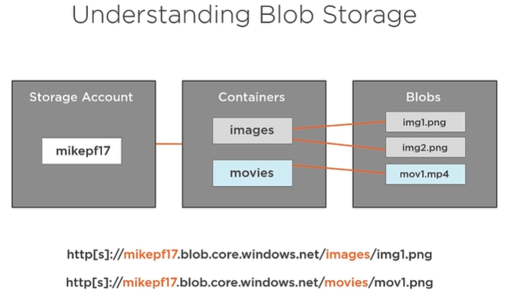
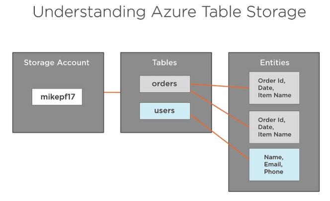
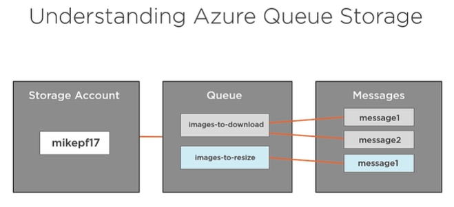

# Design and Implement Storage on Microsoft Azure

## Content

1. Overview
2. Certification Exam
3. Working with Azure Storage Blobs and Files
   1. Storage Account
4. Implementing Azure Storage Tables and Queues
   1. Tables
   2. Queues
5. Azure Storage Access and Monitoring
6. Deploying Azure SQL Databases
7. Implementing Azure Cosmos DB
8. Working with Azure Redis Caching
9. Working with Azure Redis Caching
10. Learning Checks

## Overview

Second course in a learning path for the 70-532 certification exam.

* Working with Azure Storage
* Azure Storage tables and queues
* Securing access to storage resources
* Azure Cosmos DB and Azure Redis

## Certification Exam

[Learning Path: Developing Azure Solutions (70-532)](https://www.microsoft.com/en-us/learning/exam-70-532.aspx)  
This course counts for 25-30% of the exam as of 07/08/2018 (DD/mm/YYYY)  
[Browse all of the certifications](https://www.microsoft.com/en-us/learning/browse-all-certifications.aspx)  
[Get Hands-on Practice](https://azure.microsoft.com/en-us/free/)  
[Do the learning checks on PluralSight](https://app.pluralsight.com/library/courses/microsoft-azure-design-implement-storage/learning-check)  
[Take the official practice test](https://www.microsoft.com/en-us/learning/exam-70-532.aspx#practice-test)  
[Microsoft Cloud Essentials](https://www.microsoft.com/en-us/cloudessentials)

## Working with Azure Storage Blobs and Files

Blob -> Binary Large OBject.  

Storage accounts are accessible through standard HTTP. (http[s]://`storage_account_name`.blob.core.windows.net/`container_name`/`file_name`)  

  

**Different types of blob storage:**

* Page Blobs  
   Store virtual hard disks. Optimized for random read/write operations.
* Block Blobs  
   File types like images and movies. Multiple blocks of data.
* Append Blobs  
   Text files or log files.

### Storage Account

**2 (3) types of Account Kind:**

* General purpose  
   Table storage and storage queues.
* General purpose v2
   Currently only supports Azure virtual machine disks.
* Blob storage  
  * Hot Access Tier  
    Frequently accessed data
  * Cool Access Tier  
    For backups, or other data not frequently accessed.

**Performance:**

* Standard - HDD
* Premium - SSD  
  Only locally-redundant storage available.

**Replication:**

* Zone-redundant storage (ZRS)  
   Three copies in within two datacenter
* Locally-redundant storage (LRS)  
   Three copies in the same datacenter.
* Geo-redundant storage (GRS)  
   Three copies in a primary datacenter and three copies in a secondary datacenter.
* Read-access geo-redundant storage (RA-GRS)  
   Three copies in one region and three copies in another. Read-access to both regions.

**Code Sample:**

[AzureBlobStorage.cs](code_samples/AzureBlobStorage.cs)

## Implementing Azure Storage Tables and Queues

There's a limit to how much Tables and Queues can scale up, so it might be necessary to scale out instead and plan for that.

### Tables

Built for massive scale. Items doesn't have to share schema.  

PartitionKey and RowKey are two required properties, together they form the primary key. Items are partitioned after the PartitioenKey, so items sharing the same key, would end up on the same Storage Node.

[OData Query Language](https://docs.microsoft.com/en-us/rest/api/storageservices/querying-tables-and-entities)

**Code Sample:**

[AzureTableStorage.cs](code_samples/AzureTableStorage.cs)

### Queues

  

Default lifetime for messages in the queue is 7 days. When messages are being processed they become invisible to everybody else for 30 seconds, if the worker can't process the message within the 30 seconds, the message goes back on the queue -> called visibility timeout.

Use `PeekMessage()` if you don't want to process it, but just look at it.

Queue performance and scalability decreases as the message increases in size -> short messages == better performance!

**Code Sample:**

[AzureQueueStorage.cs](code_samples/AzureQueueStorage.cs)

## Azure Storage Access and Monitoring

You can generate a Shared Access Key, allowing only access to specific resource types (Blob, Table, Files, Queues). The Key is only valid between two datetimes that you specifiy, and you can also limit the key by IP address.

You can have a maximum of 5 policies.

Monitoring logs are stored in a folder called $logs -> not visible on portal.azure.com.

You can configure CORS seperately for Blob, File, Table, and Queues.

**Code Sample:**

[StorageAccessAndMonitoring.cs](code_samples/StorageAccessAndMonitoring.cs)

## Deploying Azure SQL Databases

You can run SQL Server in two ways on Azure

* Azure SQL Database
  * Cloud Database as a Service
  * Fully managed
  * Built-in scalability and redundance
    Can enable Geo-replication -> Replicate your database across multiple regions (maximum of 4)
  * Ideal for new cloud-based applications
* SQL Server on Azure VM
  * Highly compatible with on-premises SQL Server
  * Ideal for scenarios where full server controll is required
  * Requires more maintenance and administration

[Azure SQL Database DTU Calculator](https://dtucalculator.azurewebsites.net)

## Implementing Azure Cosmos DB

## Working with Azure Redis Caching

## Implementing Azure Search

## Learning Checks

What type of database service is provided by Cosmos DB?
> NoSQL database services.

You need to inspect the metadata set on a container in a C# application. Which method should you call on the container reference object to retrieve the metadata.
> `FetchAttributes()`.

You need to enable access to blobs in your storage account using SSL-based connections using a custom domain. What should you do?
> Use Azure CDN with SSL.

You need to create a storage account that will support blobs and tables. When creating the storage account, what should you set for the account kind?
> General purpose.

You need to deploy a simple Azure Redis Cache to use for development purposes. You want to use a single node Azure Redis Cache to reduce costs. Which pricing tier should you choose?
> Basic.

You need to read an entity from an Azure storage table. Which table operation should you use in a C# application to perform the read operation?
> Retrieve.

You need to test Azure Search within one of your web applications. You need to keep costs to a minimum during the development process. Performance is not a concern. Which pricing tier should you select?
> Free.

How long are Azure storage account access keys valid?
> Until they are regenerated.

You’ve enable logging for your storage account. You need to access the log files to troubleshoot an issue. Which container should you use to retrieve the log files?
> $logs.

You need to increase the number of DTUs available for your Azure SQL database. What should you do?
> Scale up to a larger pricing tier.