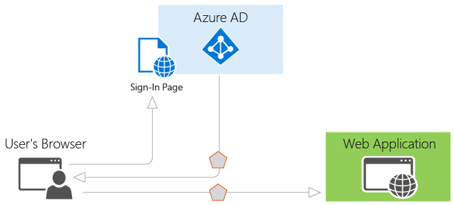

# Identity, Application, and Network Services on Microsoft Azure

## Content

1. Overview
2. Certification Exam
3. Azure Active Directory
   1. Basic of Authentication in Azure AD
   2. Protocols
   3. Demo Application
   4. Microsoft Graph API
4. Azure Key Vault
   1. Adding Keys and Secrets
      1. Keys
      2. Secret
   2. Key Vault Limits
   3. Audit Logging
   4. Key Rotation
5. Messaging Services
6. Azure AD B2B and B2C

## Overview

Third course in a learning path for the 70-532 certification exam.

* Integrating Apps with Azure Active Directory
* Managing Secrets Using Azure Key Vault
* Working with Messaging Services
* Developing Apps that use Azure AD B2B and B2C

## Certification Exam

[Learning Path: Developing Azure Solutions (70-532)](https://www.microsoft.com/en-us/learning/exam-70-532.aspx)  
This course counts for 10-15% of the exam as of 07/08/2018 (DD/mm/YYYY)  
[Browse all of the certifications](https://www.microsoft.com/en-us/learning/browse-all-certifications.aspx)  
[Get Hands-on Practice](https://azure.microsoft.com/en-us/free/)  
[Take the official practice test](https://www.microsoft.com/en-us/learning/exam-70-532.aspx#practice-test)  
[Microsoft Cloud Essentials](https://www.microsoft.com/en-us/cloudessentials)

## Azure Active Directory

[Overview of Azure AD](https://azure.microsoft.com/en-us/develop/identity/signin)  

Azure AD is an web-based Identity Service and is different from on-premise AD.

### Basic of Authentication in Azure AD

Identity as a Service.

  
[Authentication scenarios for Azure AD](https://docs.microsoft.com/en-us/azure/active-directory/develop/authentication-scenarios)  

Support for multiple Client Libraries using ADAL, and Server Libraries using OWIN. New version of Client Libraries using MSAL (also works with Microsoft Accounts).

### Protocols

* Browser based authentication
  * WS Federation
  * SAML-P 2.0
* Not browser based
  * Oauth 2.0
  * OpenID Connect

**Authentication Scenarios for Azure AD:**

* Browser Based
  * Web Browser to Web Application
* Not Browser Based
  * Single Page Application (SPA)
  * Native Application to Wb API
  * Web Application to Web API
  * Service Application to Web API

### Demo Application

[Web App WS Federation .NET](https://github.com/Azure-Samples/active-directory-dotnet-webapp-wsfederation)

### Microsoft Graph API

[Microsoft graph API](https://developer.microsoft.com/en-us/graph/docs/concepts/overview)  

Suports OData Query Language.

## Azure Key Vault

[Key Vault](https://azure.microsoft.com/en-us/services/key-vault)

Store keys and other secrets used by cloud apps and services. Premium pricing tier supper HSM keys (Hadware Support Module).

**Supports Advanced Access Policy:**

* Enable access to Azure Virtual Machines for deployment
* Enable access to Azure Resource Manager for template deployment
* Enable access to Azure Disk Encryption for volume encryption

### Adding Keys and Secrets

You can set an activation and an expiration date. You can enable and disable keys and secrets.

You can use the Cloud Shell to see the password of the secret.

#### Keys

When creating a key, you have three options:

* Generate  
  Let the key vault automatic generate a key for you
* Upload  
  Upload an key already generated somewhere else
* Restore backup  
  Restore keys from an earlier backup.

**2 key types:**

* Software key
* HSM protected key (only available in the premium tier)

#### Secrets

When creating a new secret, you have to options:

* Upload certificate
* Manual

### Managed Service Identity

Enabling managed Identity on a virtual machine install the ManagedIdentityExtension on the VM.

**Code Sample:**  
[Accessing Secrets Using a Managed Service Identity (MSI)](code_samples/AzureKeyVault.cs)

### Key Vault Limits

[Key Vault Limits](https://docs.microsoft.com/en-us/azure/key-vault/key-vault-service-limits)

### Audit Logging

To turn on Audit logging, you must turn on diagnostics.

### Key Rotation

**PowerShell Script:**

```PowerShell
$resourceGroup = 'Security'
$storageAccountName = 'myauditlogs'

New-AzureRmStorageAccountKey -ResourceGroupName $resourceGroup -Name $storageAccountName -KeyName key1

$newKey = (Get-AzureRmStorageAccountKey -Name $storageAccountName -ResourceGroupName $resourceGroup).value[0]

$secretValue = ConvertTo-SecureString $newKey -AsPlainText -Force

Set-AzureKeyVaultSecret -VaultName MyVault -Name StorageKey1 -SecretValue $secretValue
```

[Key Rotation Using Azure Automation](https://docs.microsoft.com/en-us/azure/key-vault/key-vault-key-rotation-log-monitoring)

## Messaging Services

## Azure AD B2B and B2C