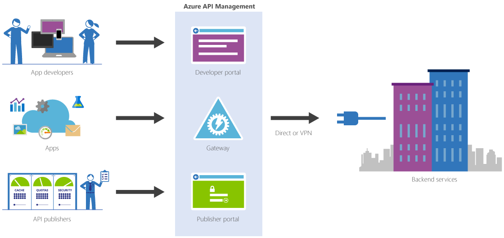

# Implement Web and Mobile Services on Microsoft Azure

## Content

1. Overview
2. Certification Exam
3. Deploying and Managing Web Apps
   1. Managing Web Apps From the CLI
4. Implement Azure Functions and WebJobs
   1. Timer App
   2. Difference Between Functions and WebJobs
5. Working with API Management
   1. Restrictions
6. Managing Azure App Service API Apps
7. Developing Azure App Service Logic Apps
8. Creating Azure App Service Mobile Apps
9. Implementing Azure Service Fabric Apps
10. Implementing Third Party PaaS Solutions
    1. Azure Container Service
    2. Container Platform
11. Designing and Implementing DevOps
12. Learning Checks

## Overview

Fourth and final course in a learning path for the 70-532 certification exam.

* Deploying and managing web apps
* Working with Azure functions and webjobs
* How to work with microservices in Azure
* How teams are embracing devops
* Building a CI/CD release pipeline

## Certification Exam

[Learning Path: Developing Azure Solutions (70-532)](https://www.microsoft.com/en-us/learning/exam-70-532.aspx)  
This course counts for 35-40% of the exam as of 07/08/2018 (DD/mm/YYYY)  
[Browse all of the certifications](https://www.microsoft.com/en-us/learning/browse-all-certifications.aspx)  
[Get Hands-on Practice](https://azure.microsoft.com/en-us/free/)  
[Take the official practice test](https://www.microsoft.com/en-us/learning/exam-70-532.aspx#practice-test)  
[Do the learning checks on PluralSight](https://app.pluralsight.com/library/courses/microsoft-azure-implement-web-mobile-services/learning-check)  
[Microsoft Cloud Essentials](https://www.microsoft.com/en-us/cloudessentials)

## Deploying and Managing Web Apps

### Managing Web Apps From the CLI

## Implement Azure Functions and WebJobs

[Overview of Azure Functions](https://azure.microsoft.com/en-us/services/functions)  

* Timer-based processing
* Azure service event processing
* Serverless web application architecture
* Serverless mobile back ends

Multiple functions inside a function app.

**Two hosting plans:**

* Consumption plan  
  Only pay for the time spent executing the function.
* App service plan  
  Monthly fees, but your function run on the same infrastructure as the other ressources on that service plan.

**Functions have 2 types of API keys:**

* Function key  
  The key only gives access to 1 function.
* Host key  
  The key gives access to all functions inside the function app.

### Timer App

CRON based schedueling in the format of `{second} {minute} {hour} {day} {month} {day of week}`

### Difference Between Functions and WebJobs

[Functions vs. WebJobs](https://docs.microsoft.com/en-us/azure/azure-functions/functions-compare-logic-apps-ms-flow-webjobs)

||Functions|WebJobs|
|--|--|--|
|Scaling|Configuraless scaling| Scale with App Service plan|
|Pricing|Pay-per-use or part of App Service plan|Part of App Servce plan|
|Run-type|Triggered, scheduled (by timer trigger)|Triggered, continous, scheduled|

## Working with API Management

[Azure API Management Overview](https://azure.microsoft.com/en-us/services/api-management)  

Resides under the domain azure-api.net, but supports custom domains as well.

The request header `Ocp-Apim-Subscription-Key` is where you put your subscription key (API key).

### Restrictions

[API Management Access Restriction Policies](https://docs.microsoft.com/en-us/azure/api-management/api-management-access-restriction-policies)  

You can throttle requests with rate limiting

* Limit call rate per key
* Limit call rate per subscription
* Set usage quota per key
* Set usage quota per subscription

## Managing Azure App Service API Apps

* Similiar to a Web App, but is a different resource
* Automating API Discovery with Swagger and Swashbuckle
* Generating Client Code with Swagger Metadata

## Developing Azure App Service Logic Apps

Workflow automation service.

[Azure Logic Apps Overview](https://azure.microsoft.com/en-us/services/logic-apps)  
[Logic Apps Create API App](https://docs.microsoft.com/en-us/azure/logic-apps/logic-apps-create-api-app)  

[Logic Apps Enterprise Integration Overview](https://docs.microsoft.com/en-us/azure/logic-apps/logic-apps-enterprise-integration-overview)

## Creating Azure App Service Mobile Apps

[Azure App Service mobile Apps Overview](https://docs.microsoft.com/en-us/azure/app-service-mobile/app-service-mobile-value-prop)  

## Implementing Azure Service Fabric Apps

Built for Microservices.

[Service Fabric Overview](https://docs.microsoft.com/en-us/azure/service-fabric/service-fabric-overview)  

**Microservices Benefits:**

* Independent scaling
* Fault isolation
* Loose coupling
* Reduced barrier to entry

[Service Fabric Get Started](https://docs.microsoft.com/en-us/azure/service-fabric/service-fabric-get-started)  

The Service Fabric cluster is built on a Virtual Machine scale set.

## Implementing Third Party PaaS Solutions

Using QuickStart Templates from Azure Marketplace, or create your own via Visual Studio.

[Managed Applications Overview](https://docs.microsoft.com/en-us/azure/managed-applications/overview)  

### Azure Container Service

Only the AZ commandline can sutomatically generate SSH keys for you by using the flag `--generate-ssh-keys`

### Container Platform

[Pivotal Cloud Foundry](https://azuremarketplace.microsoft.com/en-us/marketplace/apps/pivotal.pivotal-cloud-foundry)  
[Red Hat OpenShift Container platform](https://azuremarketplace.microsoft.com/en-us/marketplace/apps/redhat.openshift-container-platform?tab=Overview)

**OpenShift on Azure:**

* OpenShift is an open and extensible container application platform that brings Docker and Kubernetes to the enterprise
* Rapid application development
* Easy deployment and scaling

1. OpenShift Origin (open-source)
2. OpenShift Container Platform (commercial)

## Designing and Implementing DevOps

[Mobile DevOps](https://www.hockeyapp.net/blog/2015/11/18/introducing-mobile-devops.html)  

## Learning Checks

You need to set up continuous deployment for an Azure web app. The source code for the application is in GitHub. How can you do this with the least amount of effort?  
> Configure GitHub as the deployment source in the properties of the web app.

In an effort to optimize your Azure costs, all new functions should be created using the consumption hosting model. Your existing functions all run under the App Service hosting model. What should you do going forward?  
> Create a new function app and configure it to use the consumption hosting model. build all new functions inside the new function app.

You need to provide access to a REST API that you’ve built to a large number of developers. Your team has decided to use Azure API management. After publishing your API, developers are complaining that they are unable to see your API in the developer portal. What could be the problem?  
> The API has not been added to a product in API management.

You have a web app running in an Azure App Service. You need to increase the storage capacity for the web app. What should you do?  
> Scale up the App Service to a larger size that supports more storage capacity.

Your team supports a number of API apps that run in Azure App Service. You want to ensure that these apps are discoverable by client applications and other services in Azure. What should you do?  
> Create an Open API specification for each API app.

You need to create an Azure Logic App that can be used within a B2B workflow. The Logic App will transform data from one format to another when it's sent from one business to another. What’s the first thing you will need to do?  
> Create an Integration Account and associate it with the Logic App.

You’ve built a mobile backend in Azure App Service. You need to allow mobile clients to persist information to a server side database. How can you do this with the least amount of effort?  
> Use the Azure Mobile Server and Client SDKs with Easy Tables in App Service.

You’re building a Service Fabric application for an e-commerce app that will run in Azure. One of the services needs to persist data received from the user during the duration of their session. Which type of service should you implement?  
> Create a stateful service.

Your company wants to sell a custom application that can run on Azure infrastructure. What should you do?
> Build a managed application and offer it through the Azure marketplace.

You’ve developed a custom web app and have deployed it to Azure App Service. You’ve noticed that the application receives unexpected spikes in traffic and it has a negative impact on the overall performance. What can you do to resolve this issue?  
> Configure App Service auto scaling.

You need to automate the creation of a web app using the Azure CLI. What command should you use?  
> `az webapp create`

You’ve setup a continuous delivery pipeline for an Azure web app in VSTS. You notice that your builds run automatically after every commit, but your code is not getting deployed. What could be the problem?  
> Continuous deployment is not enabled in the properties of the releae definition.

You need to review the web server logs for an application running in Azure. The app runs as an App Service web app. What do you need to do to retrieve the logs?  
> Enable web server logging in the diagnostic logs section.

You want to make sure your C# based Azure functions start as quickly as possible. What can you do to achieve this?  
> Precompile the function code.

Your team has built multiple Azure functions that reside in several different function apps. You need to implement a single unified endpoint for all of the functions, regardless of which function app they are in. What should you do?  
> Create an Azure function proxy.

You’ve automated a routine task using an Azure Logic App. You need to invoke the Logic App from an external third-party application. What’s the easiest way to do this?  
> Create an HTTP trigger for the Logic App.

You’re building mobile app that will be hosted in Azure. You want to implement offline synchronization for the mobile app. What should you do?  
> Implement offline sync with the Azure Mobile Client SDK.

You need to scale the number of services you have running in a Service Fabric cluster in Azure. Which tool should you use?  
> Service Fabric Explorer.

Your team is moving a containerized application to Azure. Your team already has expertise running the application in production using the OpenShift Container Platform. You need to run the application in Azure without having to retrain the team. How can you do this with the least amount of effort?  
> Build an OpenShift Container Platform cluster from the Azure Marketplace.